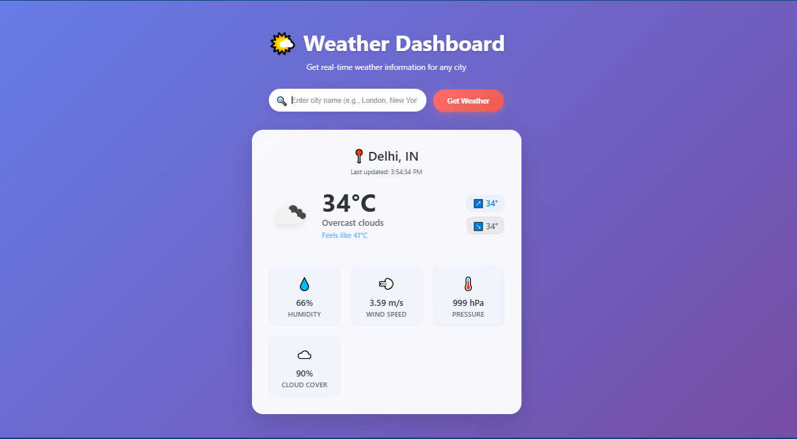

# 🌤️ Weather Dashboard

A modern weather application built with React and Vite that provides real-time weather information for any city worldwide.




## ✨ Features

- 🌍 Global weather data with beautiful UI
- 📱 Fully responsive design
- 🛡️ Comprehensive error handling
- ⚡ Fast performance with Vite

## 🚀 Quick Setup

### Prerequisites
- Node.js (16.0+)
- npm or yarn

### Installation

1. **Clone and install**
   ```bash
   git clone https://github.com/yourusername/weather-dashboard.git
   cd weather-dashboard
   npm install
   ```

2. **Setup API key**
   ```bash
   cp .env.example .env
   ```
   - Edit `.env` and replace `your_api_key_here` with your OpenWeatherMap API key
   - See detailed API key setup instructions below

3. **Run the app**
   ```bash
   npm run dev
   ```
   Open `http://localhost:5173`

## 📦 Main Dependencies

- **React** (19.0.0) - UI library
- **Vite** (6.2.0) - Build tool
- **Axios** (1.8.4) - HTTP client

## 🔧 Available Scripts

- `npm run dev` - Development server
- `npm run build` - Production build
- `npm run preview` - Preview build

## 🌐 Environment Variables

Create `.env` file with:
```env
VITE_OPENWEATHER_API_KEY=your_actual_api_key_here
```

## � How to Get Your Free API Key

### Step 1: Create Account
1. Go to [OpenWeatherMap](https://openweathermap.org/api)
2. Click **"Sign Up"** (or **"Sign In"** if you have an account)
3. Fill out the registration form:
   - Username
   - Email address
   - Password
   - Confirm you're not a robot
4. Click **"Create Account"**

### Step 2: Verify Email
1. Check your email inbox
2. Click the verification link from OpenWeatherMap
3. Your account is now activated

### Step 3: Get API Key
1. Log in to your OpenWeatherMap account
2. Go to **"My API keys"** section (usually in your account dashboard)
3. You'll see a default API key already generated
4. Copy the API key (it looks like: `a1b2c3d4e5f6g7h8i9j0k1l2m3n4o5p6`)

### Step 4: Add to Your Project
1. Open your `.env` file
2. Replace `your_api_key_here` with your actual API key:
   ```env
   VITE_OPENWEATHER_API_KEY=a1b2c3d4e5f6g7h8i9j0k1l2m3n4o5p6
   ```
3. Save the file

### ⚠️ Important Notes:
- **Free tier**: 1,000 API calls per day, 60 calls per minute
- **Activation time**: New API keys may take 10-15 minutes to activate
- **Keep it secret**: Never share your API key publicly or commit it to GitHub

## � Troubleshooting

- **App won't start**: Check Node.js version (16+) and run `npm install`
- **No weather data**: Verify API key in `.env` file
- **Build errors**: Delete `node_modules` and run `npm install`

## 🔗 Links

- [OpenWeatherMap API](https://openweathermap.org/api)
- [React Docs](https://react.dev/)
- [Vite Docs](https://vitejs.dev/)


